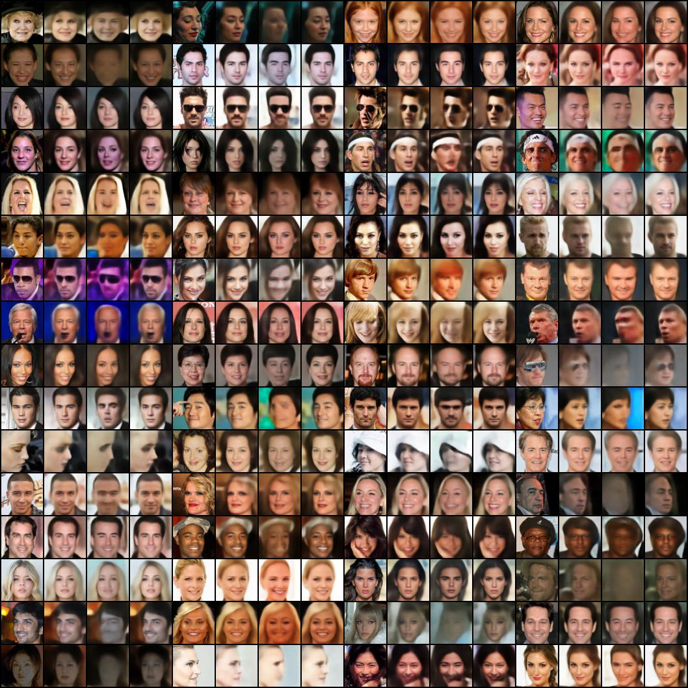

# VAEGAN: Towards Bridging the Gap between Diversity and Fidelity

> This repository contains the code of the course project for SDS 383D - 2022 Spring and continuing development.

## Model architecture:

<p align="center">

</p>

## Datasets
- MNIST
- CIFAR-10
- Celeb-A [^1]

### Note about Celeb-A precomputed statistics [[link]](http://bioinf.jku.at/research/ttur/ttur_stats/fid_stats_celeba.npz) from TTUR [^2]

Although not explicitly stated in their paper or readme doc, the original preprocessing leading to the precomputed statistics for Celeb-A in the official repo adopts a less common setting, i.e., center-cropping 108 x 108, bilinear[^3] down-sampling to 64 x 64. Under this repo, we will release precomputed statistics for both versions (one associated with the original preprocessing and the other associated with the preprocessing used in `datasets.py`). If not otherwise mentioned, we will use the latter in all experiment settings.

## Usage

```shell
usage: train.py [-h] [--model {vaegan,vae,gan}] [--backbone {resnet,dcgan}]
                [--out-act {sigmoid,tanh}] [--epochs EPOCHS] [--lr LR]
                [--d-factor D_FACTOR] [--g-factor G_FACTOR] [--beta1 BETA1]
                [--beta2 BETA2] [--dataset {mnist,cifar10,celeba}]
                [--batch-size BATCH_SIZE] [--num-workers NUM_WORKERS]
                [--root ROOT] [--task {reconstruction,generation,deblur}]
                [--device DEVICE] [--eval-device EVAL_DEVICE]
                [--base-ch BASE_CH] [--latent-dim LATENT_DIM]
                [--reconst_ch RECONST_CH] [--instance-noise]
                [--fig-dir FIG_DIR] [--chkpt-dir CHKPT_DIR]
                [--log-dir LOG_DIR] [--seed SEED] [--resume] [--calc-metrics]
                [--chkpt-intv CHKPT_INTV] [--comment COMMENT]
                [--anti-artifact]

optional arguments:
  -h, --help            show this help message and exit
  --model {vaegan,vae,gan}
  --backbone {resnet,dcgan}
  --out-act {sigmoid,tanh}
  --epochs EPOCHS
  --lr LR
  --d-factor D_FACTOR
  --g-factor G_FACTOR
  --beta1 BETA1
  --beta2 BETA2
  --dataset {mnist,cifar10,celeba}
  --batch-size BATCH_SIZE
  --num-workers NUM_WORKERS
  --root ROOT
  --task {reconstruction,generation,deblur}
  --device DEVICE
  --eval-device EVAL_DEVICE
  --base-ch BASE_CH
  --latent-dim LATENT_DIM
  --reconst_ch RECONST_CH
  --instance-noise
  --fig-dir FIG_DIR
  --chkpt-dir CHKPT_DIR
  --log-dir LOG_DIR
  --seed SEED
  --resume
  --calc-metrics
  --chkpt-intv CHKPT_INTV
  --comment COMMENT
  --anti-artifact
```

## Examples

### Generation

#### VAE

<p align="center">

</p>

#### VAEGAN

<p align="center">

</p>

#### GAN

<p align="center">

</p>

### Reconstruction

#### VAE vs VAEGAN

Each 4x4 block: (from left to right) **original, VAE, VAEGAN_reconst, VAEGAN_gen**

<p align="center">

</p>


## References

[^1]: Liu, Ziwei, et al. "Deep learning face attributes in the wild." *Proceedings of the IEEE international conference on computer vision*. 2015.
[^2]: Heusel, Martin, et al. "Gans trained by a two time-scale update rule converge to a local nash equilibrium." *Advances in neural information processing systems* 30 (2017).
[^3]: as indicated by [`scipy.image.resize`](https://github.com/scipy/scipy/blob/v0.14.0/scipy/misc/pilutil.py#L391)

