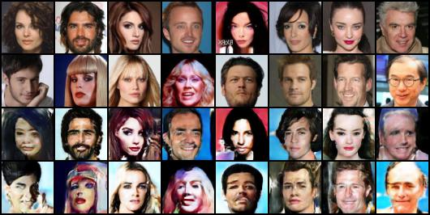
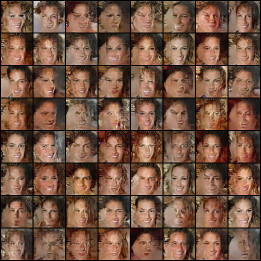

<head>
<style>
img {
	display: block;
	margin-left: auto;
	margin-right: auto;
	width: 100%
}
</style>
</head>

## VAEGAN: Towards Bridging the Gap between Diversity and Fidelity

This repository contains the code of the course project for SDS 383D - 2022 Spring.

### Model architecture:


### Usage

```
usage: train.py [-h] [--model {vae,dcgan,vaegan}] [--epochs EPOCHS] [--lr LR] [--beta1 BETA1] [--beta2 BETA2]
                [--batch-size BATCH_SIZE] [--dataset {mnist,cifar10,celeba}] [--root ROOT]
                [--task {reconstruction,generation,deblur}] [--gpus GPUS] [--latent-dim LATENT_DIM] [--fig-dir FIG_DIR]
                [--config-dir CONFIG_DIR] [--chkpt-dir CHKPT_DIR] [--log-dir LOG_DIR] [--seed SEED] [--restart]
```


### Examples

#### (Reconstruction)



#### (Generation)

